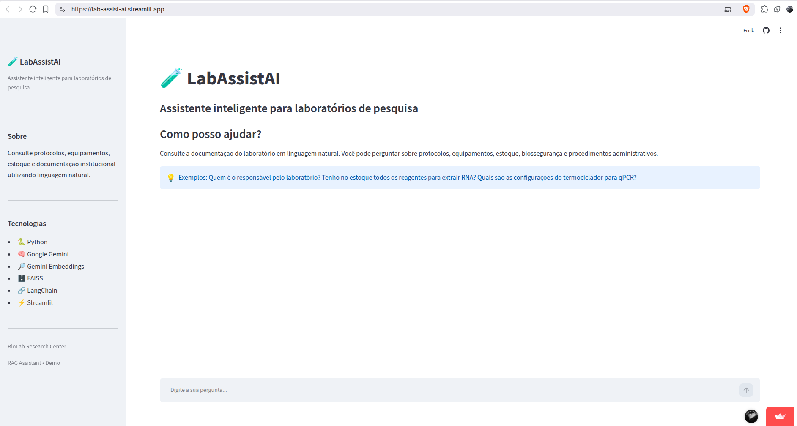
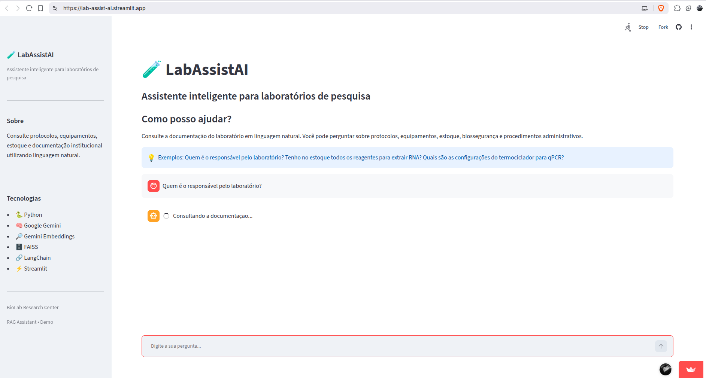
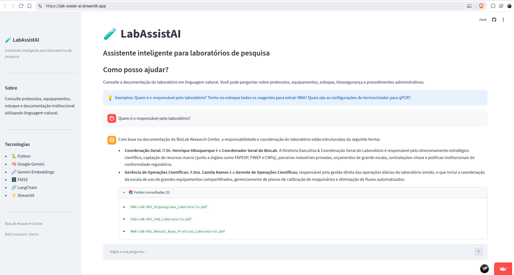
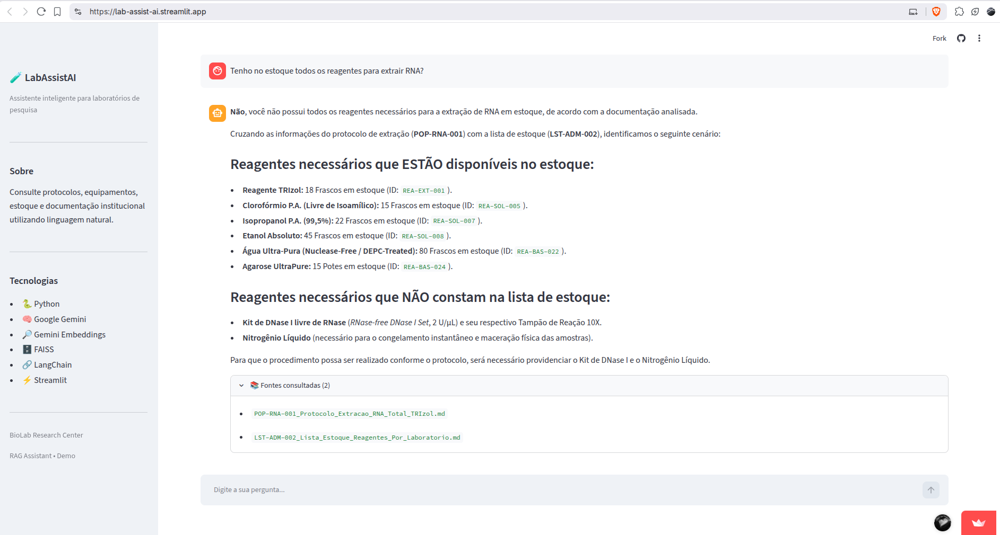
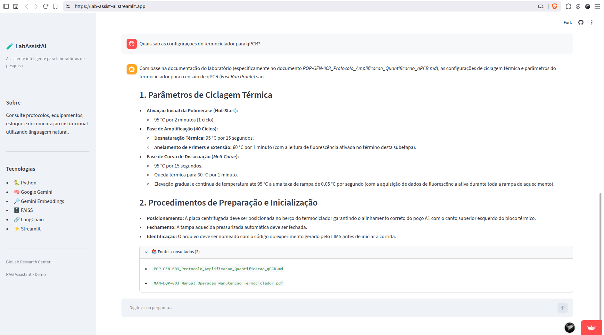

# LabAssistAI

**LabAssistAI** é um assistente inteligente para laboratórios de pesquisa baseado em Retrieval-Augmented Generation (RAG).

A aplicação permite consultar documentos institucionais por meio de linguagem natural, recuperando informações relevantes da base documental e utilizando um modelo de linguagem para gerar respostas fundamentadas nas fontes recuperadas.

O projeto foi desenvolvido como uma aplicação demonstrativa de RAG aplicada ao contexto de laboratórios de pesquisa.

O BioLab Research Center, seus funcionários e todos os documentos presentes na base de conhecimento são fictícios e foram criados exclusivamente para fins demonstrativos. Qualquer semelhança com pessoas, organizações ou documentos reais é mera coincidência.

---

## Demo

**Aplicação:** [LabAssistAI](https://lab-assist-ai.streamlit.app/)

**Código-fonte:** [GitHub](https://github.com/Thitos/lab-assist-ai)

---

## Problema

Laboratórios de pesquisa acumulam conhecimento em diferentes tipos de documentos, como:

- Procedimentos Operacionais Padrão (POPs);
- Manuais de biossegurança;
- Manuais de equipamentos;
- Documentação de onboarding;
- Documentos administrativos;
- Normas e procedimentos internos.

Quando essas informações estão distribuídas em diversos arquivos, localizar rapidamente uma informação específica pode ser difícil e consumir tempo.

O LabAssistAI busca facilitar esse acesso por meio de uma interface conversacional.

---

## Solução

O LabAssistAI utiliza uma arquitetura de **Retrieval-Augmented Generation (RAG)**.

O usuário realiza uma pergunta em linguagem natural. A aplicação:

1. recebe a pergunta através da interface Streamlit;
2. realiza uma busca semântica na base vetorial;
3. recupera os documentos mais relevantes;
4. utiliza os documentos recuperados como contexto para o modelo de linguagem;
5. gera uma resposta fundamentada no contexto recuperado;
6. apresenta as fontes utilizadas na resposta.

Quando os documentos recuperados não atingem o `SIMILARITY_THRESHOLD` definido, a aplicação informa ao usuário que a informação não foi encontrada na documentação disponível. Dessa forma, documentos com baixa similaridade não são utilizados como contexto para a geração da resposta.

---

## Arquitetura

```text
                    Usuário
                       │
                       ▼
                  Streamlit
                       │
                       ▼
                 RAG Pipeline
                       │
                       ▼
              Gemini Embeddings
                       │
                       ▼
                 Vetor da pergunta
                       │
                       ▼
               FAISS Vector Store
                       │
                       ▼
                Chunks relevantes
                       │
                       ▼
                  Contexto RAG
                       │
                       ▼
                  Gemini LLM
                       │
                       ▼
                    Resposta
                       │
                       ▼
              Fontes consultadas
````

### Pipeline de ingestão

Os documentos da base de conhecimento são processados antes da consulta:

```text
    Documentos
        │
        ▼
    Loaders
        │
        ▼
    Chunking
        │
        ▼
Gemini Embeddings
        │
        ▼
    Vetores
        │
        ▼
FAISS Vector Store
```

### Pipeline de consulta

```text
Pergunta do usuário
        │
        ▼
Gemini Embeddings
        │
        ▼
Vetor da pergunta
        │
        ▼
FAISS Vector Store
        │
        ▼
Chunks relevantes
        │
        ▼
   Contexto RAG
        │
        ▼
    Gemini LLM
        │
        ▼
    Resposta
        │
        ▼
Fontes consultadas
```

---

## Tecnologias utilizadas

- **Python**
- **LangChain**
- **Google Gemini**
- **Gemini Embeddings**
- **FAISS**
- **Streamlit**
- **PyPDF**
- **python-dotenv**
- **uv** para gerenciamento do ambiente e dependências
- **Streamlit Community Cloud** para deployment

A base documental atual utiliza arquivos:

- Markdown (`.md`);
- PDF (`.pdf`).

---

## Funcionalidades

- Perguntas em linguagem natural;
- Recuperação semântica de documentos;
- Geração de respostas utilizando contexto recuperado;
- Apresentação das fontes consultadas;
- Tratamento de perguntas fora do domínio da documentação;
- Histórico de conversa durante a sessão do Streamlit;
- Tratamento básico de falhas de API;
- Tratamento de indisponibilidade da base vetorial;
- Organização da base documental por categorias.

---

## Avaliação

O projeto possui um conjunto de 26 perguntas utilizadas para avaliar diferentes componentes do pipeline RAG.

A avaliação foi dividida em:

- Avaliação do retrieval;
- Análise do similarity threshold;
- Validação das perguntas aceitas e rejeitadas pelo threshold;
- Avaliação da geração de respostas pelo Gemini.

### Retriever

Com `RETRIEVAL_K = 4`, os resultados obtidos foram:

| Métrica | Resultado |
|---|---:|
| Perguntas respondíveis | 23 |
| Perguntas não respondíveis | 3 |
| Rank@1 | 18/23 (78,3%) |
| Top-K | 23/23 (100%) |
| Misses de retrieval | 0/23 (0%) |

### Similarity threshold

O threshold selecionado para a aplicação foi:

```text
SIMILARITY_THRESHOLD = 0.65
```

---

## Base de conhecimento

A base documental está organizada nas seguintes categorias:

```text
knowledge_base/
├── 01_onboarding/
├── 02_biosafety/
├── 03_protocols/
├── 04_equipment/
└── 05_administrative/
```

Essa organização representa diferentes áreas de conhecimento normalmente encontradas em um laboratório de pesquisa.

---

## Exemplos de perguntas

### Pergunta sobre disponibilidade de reagentes

**Pergunta:**

> Tenho no estoque todos os reagentes para extrair RNA?

**Resposta:**

O LabAssistAI consulta o protocolo de extração de RNA para identificar os reagentes necessários e verifica sua disponibilidade na lista de estoque. A partir dessas informações, o sistema identifica quais reagentes necessários estão disponíveis e quais não constam no estoque.

**Fontes consultadas:**

- POP-RNA-001_Protocolo_Extracao_RNA_Total_TRIzol.md
- LST-ADM-002_Lista_Estoque_Reagentes_Por_Laboratorio.md

---

### Pergunta sobre documentação institucional

**Pergunta:**

> Quem é o responsável pelo laboratório?

**Resposta:**

O sistema consulta a documentação institucional e apresenta as funções e responsabilidades identificadas nos documentos recuperados.

**Fontes consultadas:**

- ORG-LAB-001_Organograma_Laboratorio.pdf
- FAQ-LAB-001_FAQ_Laboratorio.pdf
- MAN-LAB-001_Manual_Boas_Praticas_Laboratorio.pdf

---

### Pergunta sobre protocolo

**Pergunta:**

> Quais são as configurações padrão do termociclador para qPCR?

**Resposta:**

O sistema recupera o protocolo de amplificação e quantificação qPCR e apresenta as informações encontradas na documentação disponível.

**Fonte consultada:**

- POP-GEN-003_Protocolo_Amplificacao_Quantificacao_qPCR.md

---

### Pergunta fora do domínio

**Pergunta:**

> Quem ganhou a Copa do Mundo em 2022?

**Resposta esperada:**

> Não encontrei essa informação na documentação disponível do laboratório.
>
> Se quiser, tente reformular a pergunta ou consulte o responsável pelo procedimento.

Esse comportamento evita que o sistema trate informações externas à base de conhecimento como se fossem informações institucionais.

---

## Estrutura do projeto

```text
lab-assist-ai/
├── main.py
├── config.py
├── prompts.py
├── rag/
│   └── pipeline.py
├── scripts/
│   ├── build_vectorstore.py
│   └── check_chunks.py
├── evaluation/
│   ├── evaluate_gemini.py
│   ├── evaluate_retriever.py
│   ├── evaluate_threshold.py
│   ├── evaluate_threshold_similarity.py
│   └── questions.json
├── knowledge_base/
├── vector_store/
├── docs/
│   └── evidence/
├── README.md
├── pyproject.toml
├── uv.lock
├── requirements.txt
├── .env.example
└── .gitignore
```

### Principais componentes

**`main.py`**

Interface Streamlit e gerenciamento do histórico da conversa.

**`rag/pipeline.py`**

Implementação do pipeline de recuperação e geração das respostas.

**`prompts.py`**

Prompt utilizado para orientar a geração das respostas baseadas no contexto recuperado.

**`config.py`**

Centralização das principais configurações da aplicação, incluindo modelos, parâmetros de recuperação e localização da base vetorial.

**`scripts/`**

Processamento dos documentos e construção da base vetorial FAISS, e recuperação de chunks para avaliação.

**`evaluation/`**

Scripts utilizados durante a avaliação do sistema.

**`knowledge_base/`**

Documentos utilizados como fonte de conhecimento.

**`vector_store/`**

Base vetorial utilizada pelo pipeline de recuperação.
O índice FAISS é versionado no repositório para permitir que a aplicação seja executada diretamente no deployment, sem necessidade de reconstruir a base vetorial durante a inicialização.

---

## Instalação

### Pré-requisitos

- Python 3.13;
- Uma API Key do Google Gemini;
- `uv` instalado.

### Instalação com uv

Clone o repositório e entre no diretório do projeto:

```bash
git clone https://github.com/Thitos/lab-assist-ai.git
cd lab-assist-ai
```

Crie o arquivo de configuração local:

```bash
cp .env.example .env
```

Configure a chave da API no arquivo `.env`:

```text
GEMINI_API_KEY=sua_chave_aqui
```

Instale as dependências:

```bash
uv sync
```

### Instalação alternativa com pip

Se você não utiliza `uv`, instale as dependências:

```bash
pip install -r requirements.txt
```

---

## Configuração

As principais configurações da aplicação estão centralizadas em `config.py`.

Entre elas:

```text
EMBEDDING_MODEL
LLM_MODEL
VECTOR_STORE_PATH
RETRIEVAL_K
SIMILARITY_THRESHOLD
TEMPERATURE
```

A chave da API não deve ser armazenada no código-fonte ou versionada no Git.

No ambiente local, a credencial é configurada por meio do arquivo `.env`.

No deployment, a credencial é configurada utilizando o mecanismo de secrets do Streamlit Community Cloud.

---

## Execução

Para iniciar a aplicação:

```bash
uv run streamlit run main.py
```

A aplicação será disponibilizada pelo Streamlit para acesso através do navegador.

### Execução alternativa com pip

Se você instalou as dependências do projeto com `pip`, inicie a aplicação com:

```bash
streamlit run main.py
```

---

## Limitações

O projeto possui algumas limitações conhecidas:

- Chunking baseado em tamanho;
- FAISS utilizado como vector store local;
- Base de conhecimento sintética para demonstração;
- Possibilidade de documentos conterem informações conflitantes;
- Ausência de autenticação de usuários;
- Ausência de controle de acesso por usuário;
- Ausência de memória persistente entre sessões;
- Qualidade das respostas dependente da recuperação dos chunks relevantes;
- A base documental atual contém arquivos Markdown e PDF;
- Documentos procedurais extensos podem exigir perguntas mais específicas para recuperar todas as etapas relevantes.

Essas limitações fazem parte do escopo da versão demonstrativa do projeto.

---

## Deploy

O deployment da aplicação foi realizado utilizando **Streamlit Community Cloud**.

Arquitetura de deployment:

```text
GitHub Repository
       │
       ▼
Streamlit Community Cloud
       │
       ├── Python environment
       ├── Application dependencies
       ├── Application secrets
       ├── Knowledge Base
       ├── FAISS Vector Store
       └── Streamlit
```

No ambiente local, a chave da API é configurada por meio do arquivo `.env`. No deployment, a credencial deve ser configurada utilizando o mecanismo de secrets da plataforma.

### Evidências de execução

A aplicação foi executada em ambiente de produção por meio do Streamlit Community Cloud.

As evidências abaixo registram a execução do agente, incluindo o carregamento da interface, o processamento das consultas, as respostas geradas e as fontes documentais recuperadas.

#### Interface inicial



#### Execução da consulta



#### Consulta sobre o responsável pelo laboratório



#### Consulta sobre disponibilidade de reagentes



#### Consulta sobre configurações do termociclador



### Vídeo da execução

[🎥 Evidência 06 — execução e tratamento de pergunta fora do escopo](docs/evidence/evidence-06-out-of-scope.mp4)

---

## Segurança

A chave da API do Gemini não deve ser armazenada no código-fonte ou no GitHub.

No ambiente local, o projeto utiliza:

```text
.env
.env.example
.gitignore
```

No deployment, a credencial é armazenada utilizando o mecanismo de secrets da plataforma.

O arquivo `.env.example` contém apenas a estrutura das variáveis necessárias, sem credenciais reais.

---

## Licença

Este projeto é distribuído sob a licença definida no arquivo `LICENSE`.
